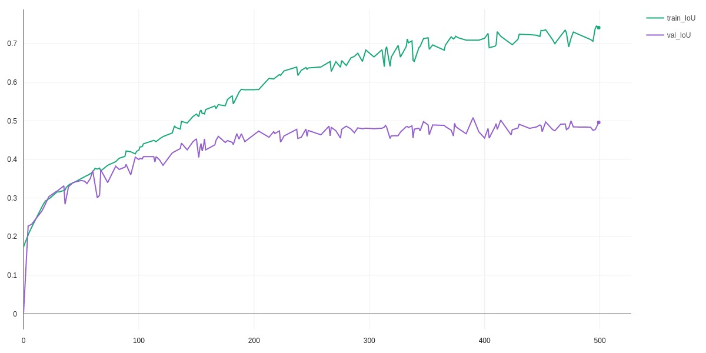
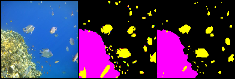
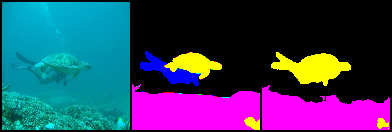
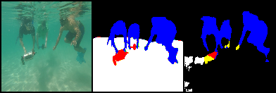
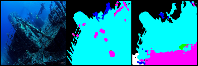
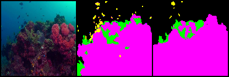

# Image Semantic-Segmentation
Multi-class Image Semantic Segmentation on underwater dataset.
There are two implemented models: a simple convolutional model and a Unet.
The training uses *Pytorch Lightning* and the hyperparameter optimization is done with *Optuna*.
The metrics, code and visualization are logged to Comet.ml during training. Check [comet.ml | semantic-segmentation](https://www.comet.ml/aklopezcarbajal/semantic-segmentation/view/XTQcsRTTflYLoZIqMLn7mpZc6/panels).

## Dataset
[Semantic Segmentation of Underwater Imagery SUIM](https://www.kaggle.com/ashish2001/semantic-segmentation-of-underwater-imagery-suim)

This dataset contains around 1500 images with pixel annotations for eight categories: fish, reefs, aquatic plants, ruins, human divers, robots and sea-floor. It also includes a test set of 110 images. The categories are color-coded as follows:

| Label | Color |
| --- | --- |
| Background (waterbody) | Black |
| Human divers | Blue |
| Aquatic plants | Green |
| Wrecks and ruins | Sky blue |
| Robots | Red |
| Reefs and invertebrates | Pink |
| Fish and vertebrates | Yellow |
| Sea-floor and rocks | White |

## Setup
* Create virtual environment
* Install requirements
```
pip install -r requirements.txt 
```
* Activate environment

## Pre-process data
The transformed data is stored in a ```.pt``` file. To generate said file run the code once passing the flag ```preprocess=True``` to ```prepare_data()```. 
Make sure you set the environment variable ```DATA_PATH``` with the directory of the dataset.
```
export DATA_PATH=/path/to/data
```

###### Known issues:  The data augmentation is implemented incorrectly since the modifications are done before training instead of during training.

## Performance during training
To train the model we chose *CrossEntropyLoss* and *Adam* as the optimizer. As for metrics, we use torchmetrics to compute `Accuracy` and `IoU` (Intersection over Union).
Using Optuna we ran 25 trials, each time training a UNet for 500 epochs and only changing the values of learning rate and weight decay to maximize the value of the IoU on the validation dataset. Out of the 25 trials, the best one was [comet.ml | magenta_madrill_8471](https://www.comet.ml/aklopezcarbajal/semantic-segmentation/40a97891e0e740cc9c48f2555bd57095?experiment-tab=chart&showOutliers=true&smoothing=0&transformY=smoothing&xAxis=step). During training, `train_IoU` reaches a value of `0.74` while `val_IoU` gets to `0.49`.
<p align="center">
  
</p>

## Results on the test set
The average IoU value on the test dataset was `0.45`. The following images show, from left to right, the input image, the true mask and the prediction mask. 
<p align="center">
  
  
</p>
<p align="center">
  
  
</p>
<p align="center">
  
  
</p>
